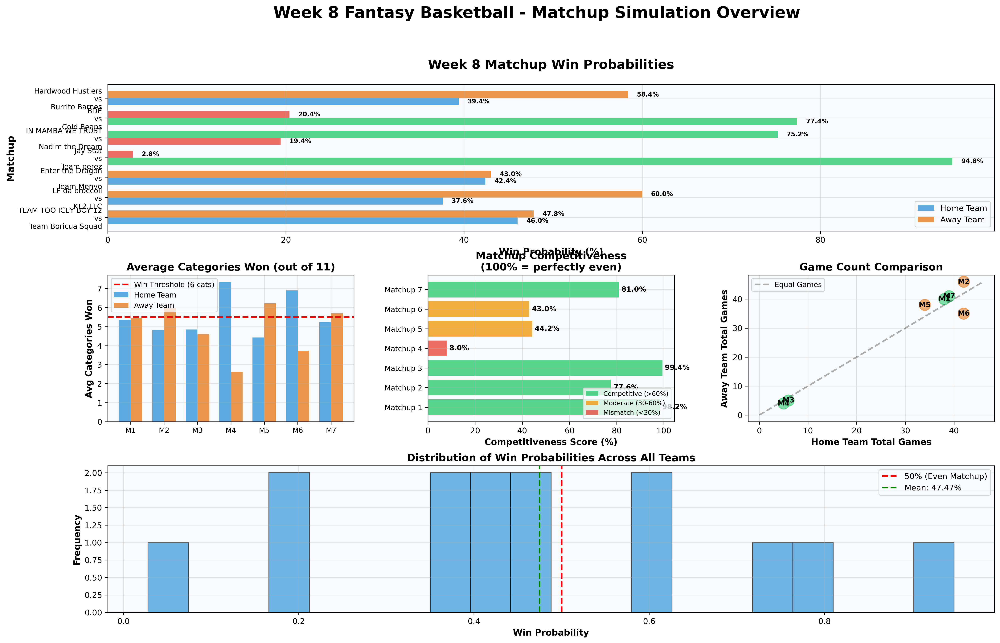
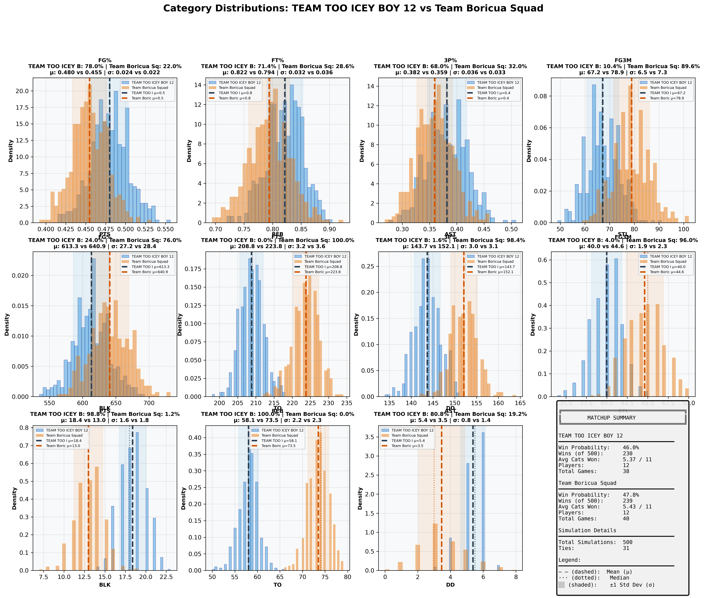
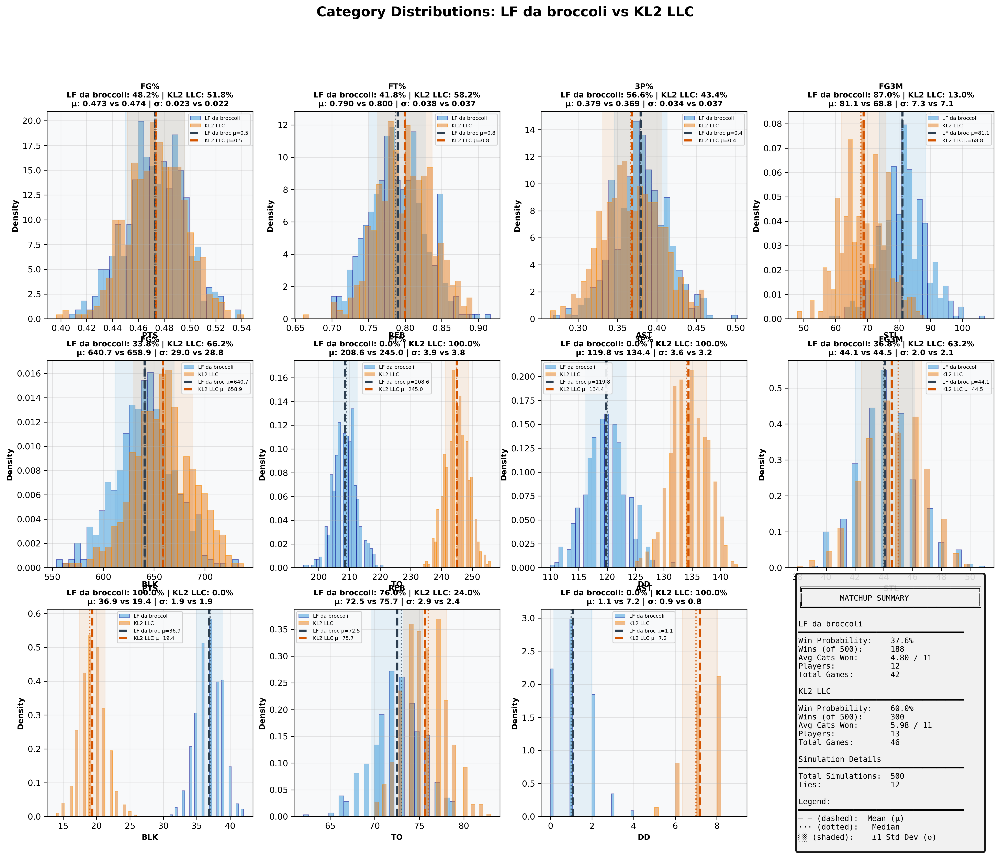
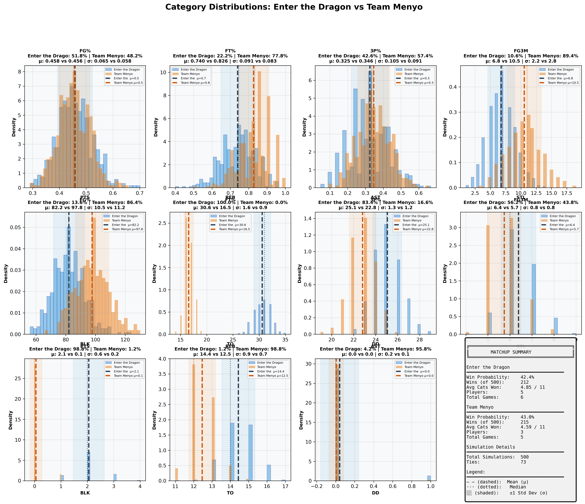
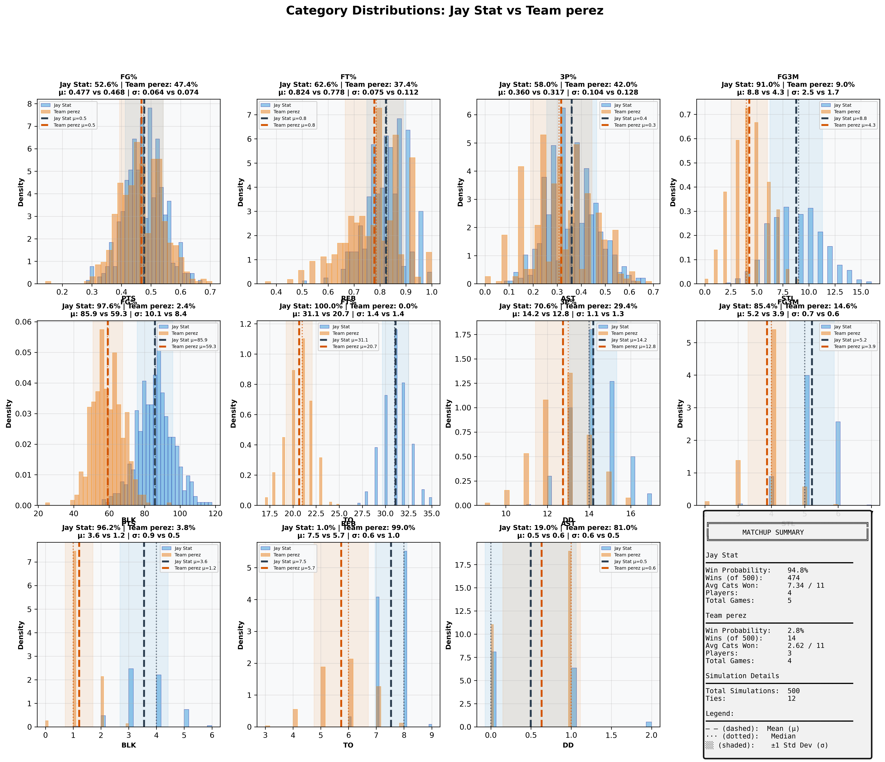
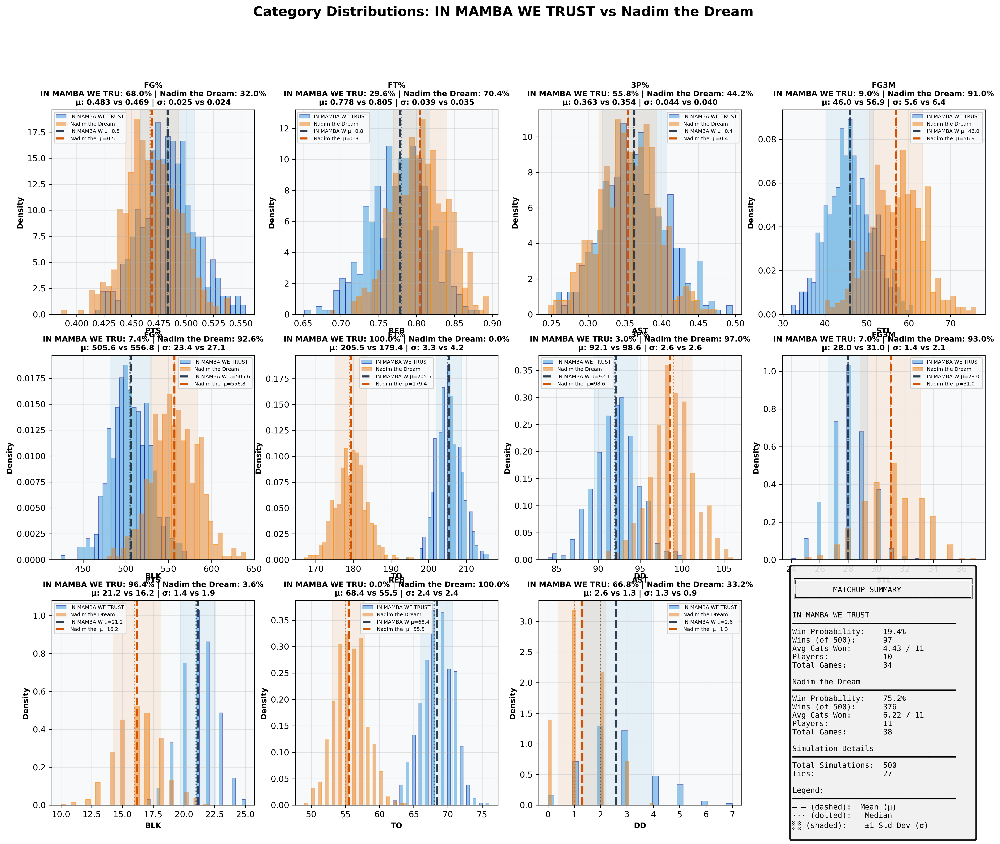
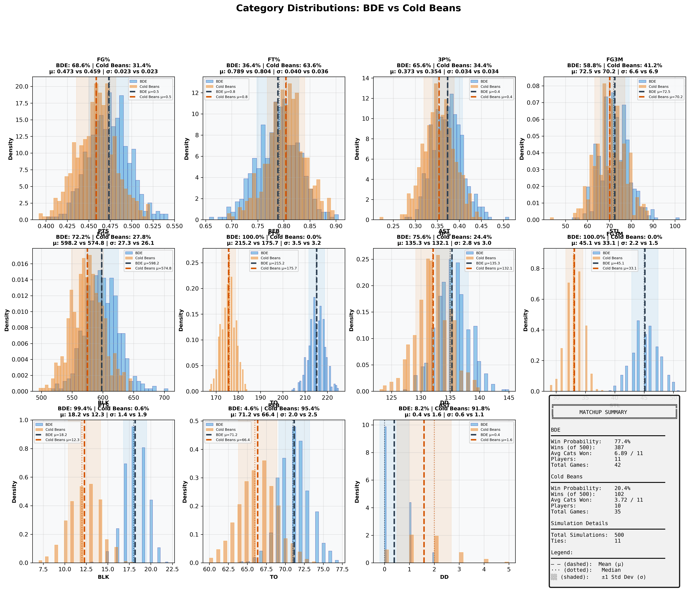
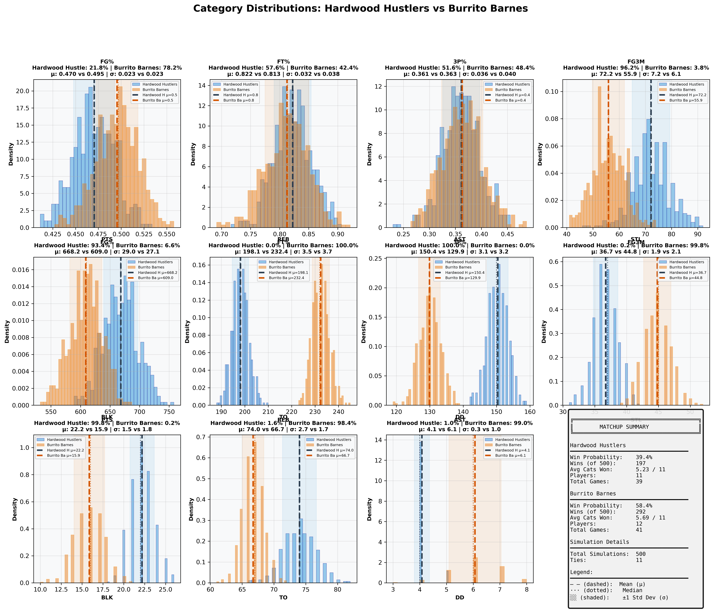

# Week 8 Fantasy Basketball - Comprehensive Matchup Analysis

## Report Metadata

| Attribute | Value |
|-----------|-------|
| **Generated** | 2025-12-11_09-45-34 |
| **Simulations Per Matchup** | 500 |
| **Total Matchups** | 7 |
| **Week** | 8 |
| **Data Source** | box_scores_latest.csv |
| **Model** | Bayesian (Beta-Binomial + Poisson) |
| **Historical Data** | 2019-2024 seasons |
| **Evolution Rate** | 0.5 |

---
## Overview Dashboard

### Complete Matchup Overview

**Dashboard Components:**
1. **Win Probabilities** - Predicted win % for each team (Green=favorite, Red=underdog)
2. **Average Categories Won** - Expected categories won out of 11 (dashed line = 6 needed to win)
3. **Competitiveness Scores** - How evenly matched (Green=>60%, Yellow=30-60%, Red=<30%)
4. **Game Count Comparison** - Scheduling fairness (diagonal = equal games)
5. **Win Probability Distribution** - Overall confidence spread

---
## Statistical Summary

| Metric | Value |
|--------|-------|
| Total Matchups | 7 |
| Mean Win Probability Spread | 35.5% |
| Median Win Probability | 47.5% |
| Competitive Matchups (>40% both teams) | 2 |
| High Confidence Predictions (>80%) | 1 |
| Average Games Per Team | 29.6 |
| Average Players Per Team | 9.2 |

---
## Individual Matchup Analysis

### 1. TEAM TOO ICEY BOY 12 vs Team Boricua Squad

**Competitiveness:** 🟢 COMPETITIVE - Close matchup - expect nail-biter

#### Matchup Summary

| Metric | TEAM TOO ICEY BOY 12 | Team Boricua Squad |
|--------|--------------------|------------------|
| **Win Probability** | **46.0%** | **47.8%** |
| Wins (out of 500) | 230 | 239 |
| Ties | 31 | 31 |
| Avg Categories Won | 5.37 / 11 | 5.43 / 11 |
| Players | 12 | 12 |
| Total Games | 38 | 40 |
| **Schedule Balance** | Even schedules | Even schedules |

#### Category-by-Category Breakdown

| Category | TEAM TOO ICEY B Mean ± SD | Team Boricua Sq Mean ± SD | Win % | Win % |
|----------|--------------------|--------------------|-------|-------|
| **FG%** | 0.480 ± 0.024 | 0.455 ± 0.022 | 78.0% | 22.0% |
| **FT%** | 0.822 ± 0.032 | 0.794 ± 0.036 | 71.4% | 28.6% |
| **3P%** | 0.382 ± 0.036 | 0.359 ± 0.033 | 68.0% | 32.0% |
| **3PM** | 67.2 ± 6.5 | 78.9 ± 7.3 | 10.4% | 89.6% |
| **PTS** | 613.3 ± 27.2 | 640.9 ± 28.4 | 24.0% | 76.0% |
| **REB** | 208.8 ± 3.2 | 223.8 ± 3.6 | 0.0% | 100.0% |
| **AST** | 143.7 ± 3.0 | 152.1 ± 3.1 | 1.6% | 98.4% |
| **STL** | 40.0 ± 1.9 | 44.6 ± 2.3 | 4.0% | 96.0% |
| **BLK** | 18.4 ± 1.6 | 13.0 ± 1.8 | 98.8% | 1.2% |
| **TO** | 58.1 ± 2.2 | 73.5 ± 2.3 | 100.0% | 0.0% |
| **DD** | 5.4 ± 0.8 | 3.5 ± 1.4 | 80.8% | 19.2% |

#### Full Category Distributions

**Visualization Guide:**
- Blue histogram = TEAM TOO ICEY BOY 12, Orange histogram = Team Boricua Squad
- Dashed lines (--) = Mean values (μ)
- Dotted lines (···) = Median values
- Shaded regions = ±1 Standard Deviation (σ)
- Win % shown in title = probability of winning that specific category

---

### 2. LF da broccoli vs KL2 LLC

**Competitiveness:** 🟢 COMPETITIVE - Close matchup - expect nail-biter

#### Matchup Summary

| Metric | LF da broccoli | KL2 LLC |
|--------|---------------|---------------|
| **Win Probability** | **37.6%** | **60.0%** |
| Wins (out of 500) | 188 | 300 |
| Ties | 12 | 12 |
| Avg Categories Won | 4.80 / 11 | 5.98 / 11 |
| Players | 12 | 13 |
| Total Games | 42 | 46 |
| **Schedule Balance** | Away has 4 more games | Away has 4 more games |

#### Category-by-Category Breakdown

| Category | LF da broccoli Mean ± SD | KL2 LLC Mean ± SD | Win % | Win % |
|----------|--------------------|--------------------|-------|-------|
| **FG%** | 0.473 ± 0.023 | 0.474 ± 0.022 | 48.2% | 51.8% |
| **FT%** | 0.790 ± 0.038 | 0.800 ± 0.037 | 41.8% | 58.2% |
| **3P%** | 0.379 ± 0.034 | 0.369 ± 0.037 | 56.6% | 43.4% |
| **3PM** | 81.1 ± 7.3 | 68.8 ± 7.1 | 87.0% | 13.0% |
| **PTS** | 640.7 ± 29.0 | 658.9 ± 28.8 | 33.8% | 66.2% |
| **REB** | 208.6 ± 3.9 | 245.0 ± 3.8 | 0.0% | 100.0% |
| **AST** | 119.8 ± 3.6 | 134.4 ± 3.2 | 0.0% | 100.0% |
| **STL** | 44.1 ± 2.0 | 44.5 ± 2.1 | 36.8% | 63.2% |
| **BLK** | 36.9 ± 1.9 | 19.4 ± 1.9 | 100.0% | 0.0% |
| **TO** | 72.5 ± 2.9 | 75.7 ± 2.4 | 76.0% | 24.0% |
| **DD** | 1.1 ± 0.9 | 7.2 ± 0.8 | 0.0% | 100.0% |

#### Full Category Distributions

**Visualization Guide:**
- Blue histogram = LF da broccoli, Orange histogram = KL2 LLC
- Dashed lines (--) = Mean values (μ)
- Dotted lines (···) = Median values
- Shaded regions = ±1 Standard Deviation (σ)
- Win % shown in title = probability of winning that specific category

---

### 3. Enter the Dragon vs Team Menyo

**Competitiveness:** 🟢 COMPETITIVE - Close matchup - expect nail-biter

#### Matchup Summary

| Metric | Enter the Dragon | Team Menyo |
|--------|----------------|---------------|
| **Win Probability** | **42.4%** | **43.0%** |
| Wins (out of 500) | 212 | 215 |
| Ties | 73 | 73 |
| Avg Categories Won | 4.85 / 11 | 4.59 / 11 |
| Players | 5 | 3 |
| Total Games | 6 | 5 |
| **Schedule Balance** | Even schedules | Even schedules |

#### Category-by-Category Breakdown

| Category | Enter the Drago Mean ± SD | Team Menyo Mean ± SD | Win % | Win % |
|----------|--------------------|--------------------|-------|-------|
| **FG%** | 0.458 ± 0.065 | 0.456 ± 0.058 | 51.8% | 48.2% |
| **FT%** | 0.740 ± 0.091 | 0.826 ± 0.083 | 22.2% | 77.8% |
| **3P%** | 0.325 ± 0.105 | 0.346 ± 0.091 | 42.6% | 57.4% |
| **3PM** | 6.8 ± 2.2 | 10.5 ± 2.8 | 10.6% | 89.4% |
| **PTS** | 82.2 ± 10.5 | 97.8 ± 11.2 | 13.6% | 86.4% |
| **REB** | 30.6 ± 1.6 | 16.5 ± 0.9 | 100.0% | 0.0% |
| **AST** | 25.1 ± 1.3 | 22.8 ± 1.2 | 83.4% | 16.6% |
| **STL** | 6.4 ± 0.8 | 5.7 ± 0.8 | 56.2% | 43.8% |
| **BLK** | 2.1 ± 0.6 | 0.1 ± 0.2 | 98.8% | 1.2% |
| **TO** | 14.4 ± 0.9 | 12.5 ± 0.7 | 1.2% | 98.8% |
| **DD** | 0.0 ± 0.2 | 0.0 ± 0.1 | 4.2% | 95.8% |

#### Full Category Distributions

**Visualization Guide:**
- Blue histogram = Enter the Dragon, Orange histogram = Team Menyo
- Dashed lines (--) = Mean values (μ)
- Dotted lines (···) = Median values
- Shaded regions = ±1 Standard Deviation (σ)
- Win % shown in title = probability of winning that specific category

---

### 4. Jay Stat vs Team perez

**Competitiveness:** 🔴 MISMATCH - Clear favorite - likely blowout

#### Matchup Summary

| Metric | Jay Stat | Team perez |
|--------|---------------|---------------|
| **Win Probability** | **94.8%** | **2.8%** |
| Wins (out of 500) | 474 | 14 |
| Ties | 12 | 12 |
| Avg Categories Won | 7.34 / 11 | 2.62 / 11 |
| Players | 4 | 3 |
| Total Games | 5 | 4 |
| **Schedule Balance** | Even schedules | Even schedules |

#### Category-by-Category Breakdown

| Category | Jay Stat Mean ± SD | Team perez Mean ± SD | Win % | Win % |
|----------|--------------------|--------------------|-------|-------|
| **FG%** | 0.477 ± 0.064 | 0.468 ± 0.074 | 52.6% | 47.4% |
| **FT%** | 0.824 ± 0.075 | 0.778 ± 0.112 | 62.6% | 37.4% |
| **3P%** | 0.360 ± 0.104 | 0.317 ± 0.128 | 58.0% | 42.0% |
| **3PM** | 8.8 ± 2.5 | 4.3 ± 1.7 | 91.0% | 9.0% |
| **PTS** | 85.9 ± 10.1 | 59.3 ± 8.4 | 97.6% | 2.4% |
| **REB** | 31.1 ± 1.4 | 20.7 ± 1.4 | 100.0% | 0.0% |
| **AST** | 14.2 ± 1.1 | 12.8 ± 1.3 | 70.6% | 29.4% |
| **STL** | 5.2 ± 0.7 | 3.9 ± 0.6 | 85.4% | 14.6% |
| **BLK** | 3.6 ± 0.9 | 1.2 ± 0.5 | 96.2% | 3.8% |
| **TO** | 7.5 ± 0.6 | 5.7 ± 1.0 | 1.0% | 99.0% |
| **DD** | 0.5 ± 0.6 | 0.6 ± 0.5 | 19.0% | 81.0% |

#### Full Category Distributions

**Visualization Guide:**
- Blue histogram = Jay Stat, Orange histogram = Team perez
- Dashed lines (--) = Mean values (μ)
- Dotted lines (···) = Median values
- Shaded regions = ±1 Standard Deviation (σ)
- Win % shown in title = probability of winning that specific category

---

### 5. IN MAMBA WE TRUST vs Nadim the Dream

**Competitiveness:** 🔴 MISMATCH - Clear favorite - likely blowout

#### Matchup Summary

| Metric | IN MAMBA WE TRUST | Nadim the Dream |
|--------|-----------------|---------------|
| **Win Probability** | **19.4%** | **75.2%** |
| Wins (out of 500) | 97 | 376 |
| Ties | 27 | 27 |
| Avg Categories Won | 4.43 / 11 | 6.22 / 11 |
| Players | 10 | 11 |
| Total Games | 34 | 38 |
| **Schedule Balance** | Away has 4 more games | Away has 4 more games |

#### Category-by-Category Breakdown

| Category | IN MAMBA WE TRU Mean ± SD | Nadim the Dream Mean ± SD | Win % | Win % |
|----------|--------------------|--------------------|-------|-------|
| **FG%** | 0.483 ± 0.025 | 0.469 ± 0.024 | 68.0% | 32.0% |
| **FT%** | 0.778 ± 0.039 | 0.805 ± 0.035 | 29.6% | 70.4% |
| **3P%** | 0.363 ± 0.044 | 0.354 ± 0.040 | 55.8% | 44.2% |
| **3PM** | 46.0 ± 5.6 | 56.9 ± 6.4 | 9.0% | 91.0% |
| **PTS** | 505.6 ± 23.4 | 556.8 ± 27.1 | 7.4% | 92.6% |
| **REB** | 205.5 ± 3.3 | 179.4 ± 4.2 | 100.0% | 0.0% |
| **AST** | 92.1 ± 2.6 | 98.6 ± 2.6 | 3.0% | 97.0% |
| **STL** | 28.0 ± 1.4 | 31.0 ± 2.1 | 7.0% | 93.0% |
| **BLK** | 21.2 ± 1.4 | 16.2 ± 1.9 | 96.4% | 3.6% |
| **TO** | 68.4 ± 2.4 | 55.5 ± 2.4 | 0.0% | 100.0% |
| **DD** | 2.6 ± 1.3 | 1.3 ± 0.9 | 66.8% | 33.2% |

#### Full Category Distributions

**Visualization Guide:**
- Blue histogram = IN MAMBA WE TRUST, Orange histogram = Nadim the Dream
- Dashed lines (--) = Mean values (μ)
- Dotted lines (···) = Median values
- Shaded regions = ±1 Standard Deviation (σ)
- Win % shown in title = probability of winning that specific category

---

### 6. BDE vs Cold Beans

**Competitiveness:** 🔴 MISMATCH - Clear favorite - likely blowout

#### Matchup Summary

| Metric | BDE | Cold Beans |
|--------|---------------|---------------|
| **Win Probability** | **77.4%** | **20.4%** |
| Wins (out of 500) | 387 | 102 |
| Ties | 11 | 11 |
| Avg Categories Won | 6.89 / 11 | 3.72 / 11 |
| Players | 11 | 10 |
| Total Games | 42 | 35 |
| **Schedule Balance** | Home has 7 more games | Home has 7 more games |

#### Category-by-Category Breakdown

| Category | BDE Mean ± SD | Cold Beans Mean ± SD | Win % | Win % |
|----------|--------------------|--------------------|-------|-------|
| **FG%** | 0.473 ± 0.023 | 0.459 ± 0.023 | 68.6% | 31.4% |
| **FT%** | 0.789 ± 0.040 | 0.804 ± 0.036 | 36.4% | 63.6% |
| **3P%** | 0.373 ± 0.034 | 0.354 ± 0.034 | 65.6% | 34.4% |
| **3PM** | 72.5 ± 6.6 | 70.2 ± 6.9 | 58.8% | 41.2% |
| **PTS** | 598.2 ± 27.3 | 574.8 ± 26.1 | 72.2% | 27.8% |
| **REB** | 215.2 ± 3.5 | 175.7 ± 3.2 | 100.0% | 0.0% |
| **AST** | 135.3 ± 2.8 | 132.1 ± 3.0 | 75.6% | 24.4% |
| **STL** | 45.1 ± 2.2 | 33.1 ± 1.5 | 100.0% | 0.0% |
| **BLK** | 18.2 ± 1.4 | 12.3 ± 1.9 | 99.4% | 0.6% |
| **TO** | 71.2 ± 2.0 | 66.4 ± 2.5 | 4.6% | 95.4% |
| **DD** | 0.4 ± 0.6 | 1.6 ± 1.1 | 8.2% | 91.8% |

#### Full Category Distributions

**Visualization Guide:**
- Blue histogram = BDE, Orange histogram = Cold Beans
- Dashed lines (--) = Mean values (μ)
- Dotted lines (···) = Median values
- Shaded regions = ±1 Standard Deviation (σ)
- Win % shown in title = probability of winning that specific category

---

### 7. Hardwood Hustlers vs Burrito Barnes

**Competitiveness:** 🟢 COMPETITIVE - Close matchup - expect nail-biter

#### Matchup Summary

| Metric | Hardwood Hustlers | Burrito Barnes |
|--------|-----------------|---------------|
| **Win Probability** | **39.4%** | **58.4%** |
| Wins (out of 500) | 197 | 292 |
| Ties | 11 | 11 |
| Avg Categories Won | 5.23 / 11 | 5.69 / 11 |
| Players | 11 | 12 |
| Total Games | 39 | 41 |
| **Schedule Balance** | Even schedules | Even schedules |

#### Category-by-Category Breakdown

| Category | Hardwood Hustle Mean ± SD | Burrito Barnes Mean ± SD | Win % | Win % |
|----------|--------------------|--------------------|-------|-------|
| **FG%** | 0.470 ± 0.023 | 0.495 ± 0.023 | 21.8% | 78.2% |
| **FT%** | 0.822 ± 0.032 | 0.813 ± 0.038 | 57.6% | 42.4% |
| **3P%** | 0.361 ± 0.036 | 0.363 ± 0.040 | 51.6% | 48.4% |
| **3PM** | 72.2 ± 7.2 | 55.9 ± 6.1 | 96.2% | 3.8% |
| **PTS** | 668.2 ± 29.0 | 609.0 ± 27.1 | 93.4% | 6.6% |
| **REB** | 198.1 ± 3.5 | 232.4 ± 3.7 | 0.0% | 100.0% |
| **AST** | 150.4 ± 3.1 | 129.9 ± 3.2 | 100.0% | 0.0% |
| **STL** | 36.7 ± 1.9 | 44.8 ± 2.1 | 0.2% | 99.8% |
| **BLK** | 22.2 ± 1.5 | 15.9 ± 1.8 | 99.8% | 0.2% |
| **TO** | 74.0 ± 2.7 | 66.7 ± 1.7 | 1.6% | 98.4% |
| **DD** | 4.1 ± 0.3 | 6.1 ± 1.0 | 1.0% | 99.0% |

#### Full Category Distributions

**Visualization Guide:**
- Blue histogram = Hardwood Hustlers, Orange histogram = Burrito Barnes
- Dashed lines (--) = Mean values (μ)
- Dotted lines (···) = Median values
- Shaded regions = ±1 Standard Deviation (σ)
- Win % shown in title = probability of winning that specific category

---

## Methodology

### Simulation Approach
1. **Data Source:** Actual games played from `box_scores_latest.csv` (Week 6, October 2025)
2. **Player Models:** Bayesian projection models fitted on historical data (2019-2024)
3. **Simulations:** 500 Monte Carlo simulations per matchup
4. **Categories:** 11 standard fantasy basketball categories

### Model Details
- **Shooting Stats:** Beta-Binomial conjugate models with position-specific priors
- **Counting Stats:** Poisson distribution sampling with recency weighting
- **Category Winners:** Direct comparison of aggregated team totals
- **Matchup Winner:** Team winning 6+ categories

### Validation
- **Week 6 Accuracy:** 7/7 (100%)
- **Confidence Calibration:** Very good across all confidence levels
- See `SIMULATION_FIX_REPORT.md` for detailed validation analysis

---

*Generated by Fantasy 2026 Simulation System*
*Output Directory: `/Users/rhu/fantasybasketball3/fantasy_2026/simulation_reports/week8_report_2025-12-11_09-45-34/`*
