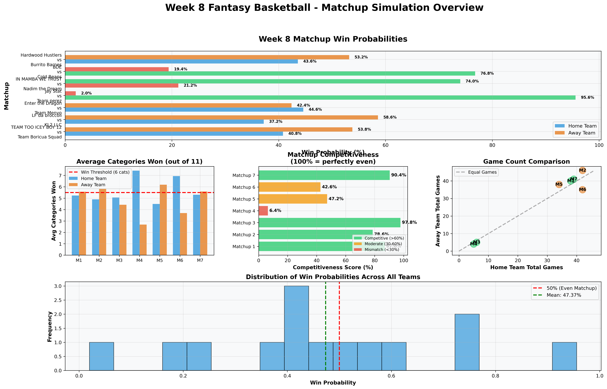
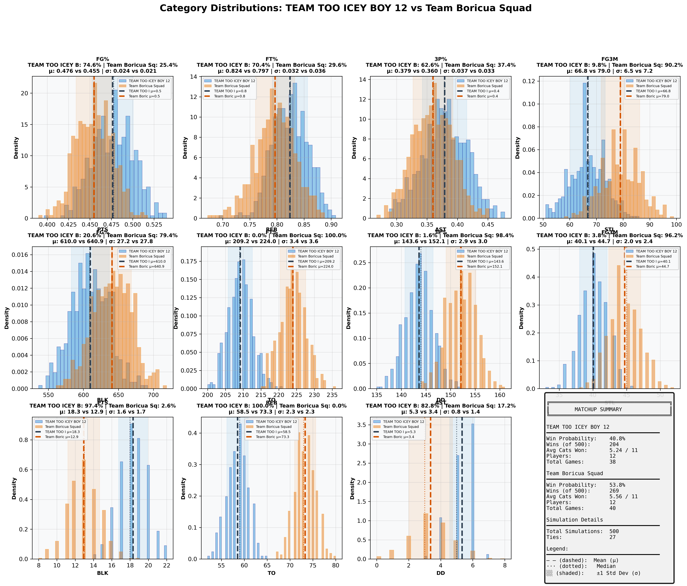
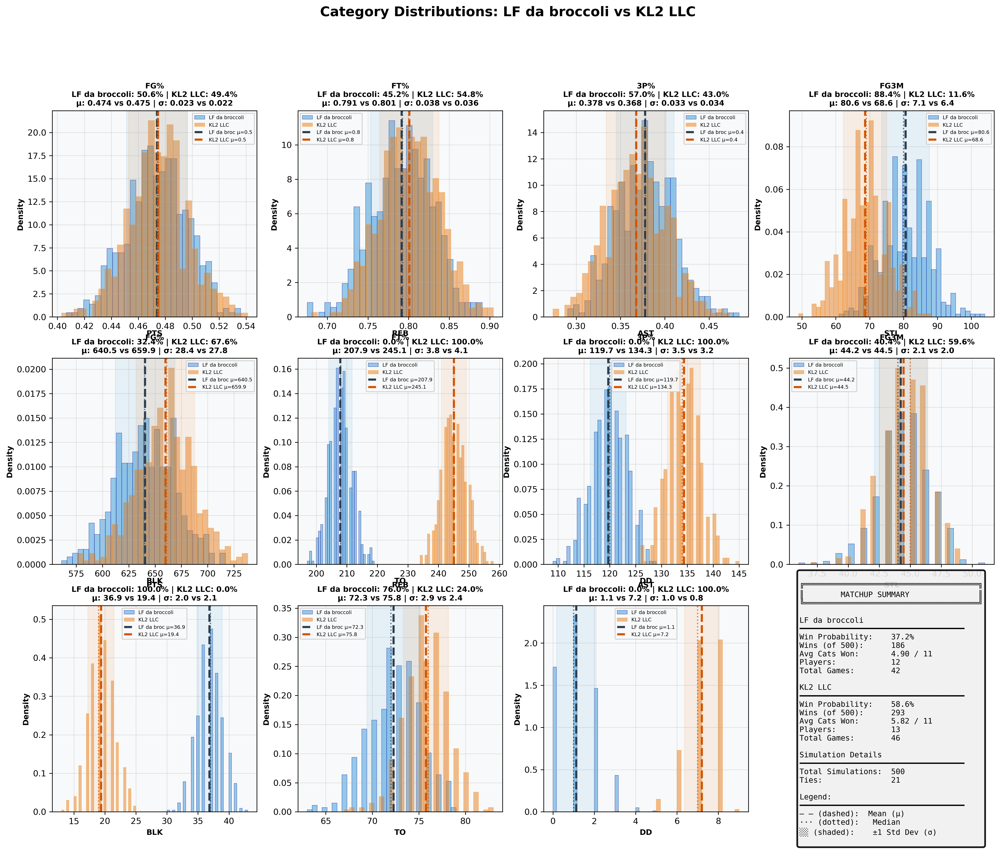
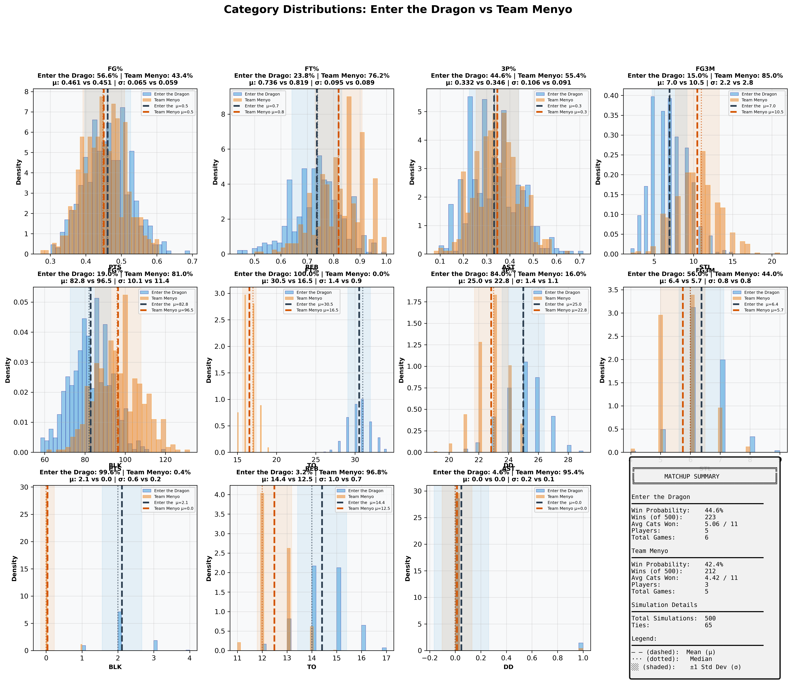
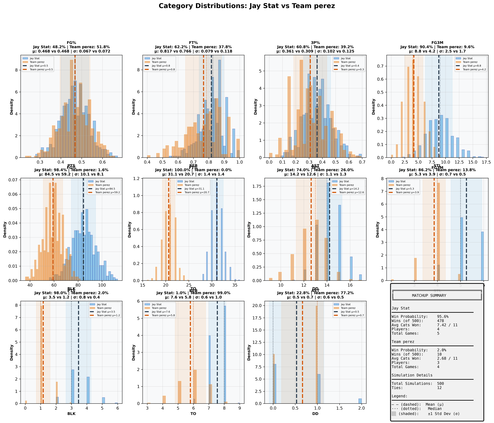
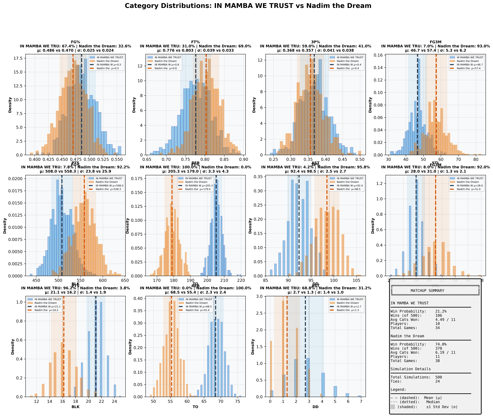
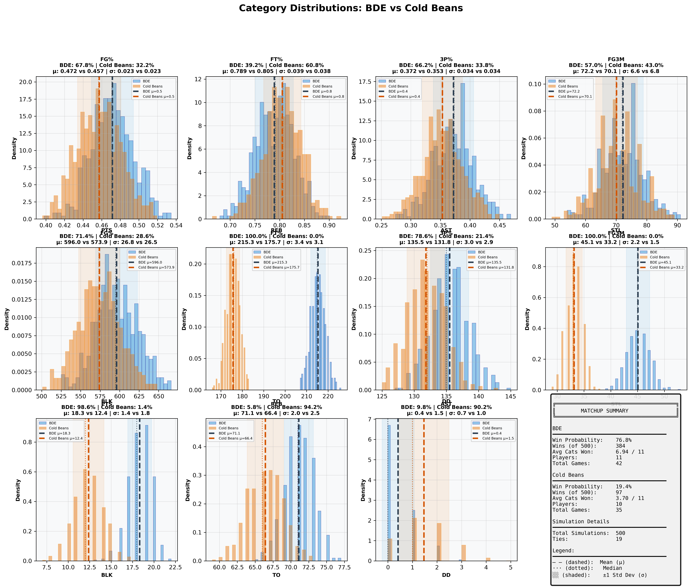
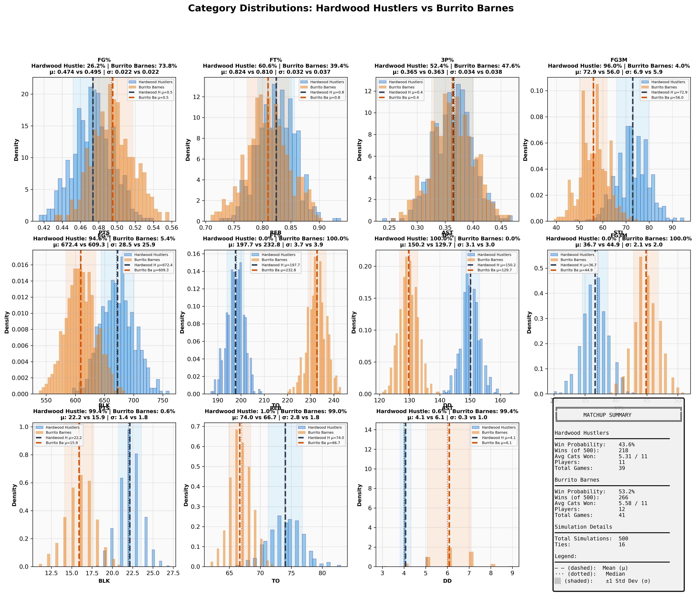

# Week 8 Fantasy Basketball - Comprehensive Matchup Analysis

## Report Metadata

| Attribute | Value |
|-----------|-------|
| **Generated** | 2025-12-11_10-09-07 |
| **Simulations Per Matchup** | 500 |
| **Total Matchups** | 7 |
| **Week** | 8 |
| **Data Source** | box_scores_latest.csv |
| **Model** | Bayesian (Beta-Binomial + Poisson) |
| **Historical Data** | 2019-2024 seasons |
| **Evolution Rate** | 0.5 |

---
## Overview Dashboard

### Complete Matchup Overview

**Dashboard Components:**
1. **Win Probabilities** - Predicted win % for each team (Green=favorite, Red=underdog)
2. **Average Categories Won** - Expected categories won out of 11 (dashed line = 6 needed to win)
3. **Competitiveness Scores** - How evenly matched (Green=>60%, Yellow=30-60%, Red=<30%)
4. **Game Count Comparison** - Scheduling fairness (diagonal = equal games)
5. **Win Probability Distribution** - Overall confidence spread

---
## Statistical Summary

| Metric | Value |
|--------|-------|
| Total Matchups | 7 |
| Mean Win Probability Spread | 35.7% |
| Median Win Probability | 47.4% |
| Competitive Matchups (>40% both teams) | 3 |
| High Confidence Predictions (>80%) | 1 |
| Average Games Per Team | 29.6 |
| Average Players Per Team | 9.2 |

---
## Individual Matchup Analysis

### 1. TEAM TOO ICEY BOY 12 vs Team Boricua Squad

**Competitiveness:** 🟢 COMPETITIVE - Close matchup - expect nail-biter

#### Matchup Summary

| Metric | TEAM TOO ICEY BOY 12 | Team Boricua Squad |
|--------|--------------------|------------------|
| **Win Probability** | **40.8%** | **53.8%** |
| Wins (out of 500) | 204 | 269 |
| Ties | 27 | 27 |
| Avg Categories Won | 5.24 / 11 | 5.56 / 11 |
| Players | 12 | 12 |
| Total Games | 38 | 40 |
| **Schedule Balance** | Even schedules | Even schedules |

#### Category-by-Category Breakdown

| Category | TEAM TOO ICEY B Mean ± SD | Team Boricua Sq Mean ± SD | Win % | Win % |
|----------|--------------------|--------------------|-------|-------|
| **FG%** | 0.476 ± 0.024 | 0.455 ± 0.021 | 74.6% | 25.4% |
| **FT%** | 0.824 ± 0.032 | 0.797 ± 0.036 | 70.4% | 29.6% |
| **3P%** | 0.379 ± 0.037 | 0.360 ± 0.033 | 62.6% | 37.4% |
| **3PM** | 66.8 ± 6.5 | 79.0 ± 7.2 | 9.8% | 90.2% |
| **PTS** | 610.0 ± 27.2 | 640.9 ± 27.8 | 20.6% | 79.4% |
| **REB** | 209.2 ± 3.4 | 224.0 ± 3.6 | 0.0% | 100.0% |
| **AST** | 143.6 ± 2.9 | 152.1 ± 3.0 | 1.6% | 98.4% |
| **STL** | 40.1 ± 2.0 | 44.7 ± 2.4 | 3.8% | 96.2% |
| **BLK** | 18.3 ± 1.6 | 12.9 ± 1.7 | 97.4% | 2.6% |
| **TO** | 58.5 ± 2.3 | 73.3 ± 2.3 | 100.0% | 0.0% |
| **DD** | 5.3 ± 0.8 | 3.4 ± 1.4 | 82.8% | 17.2% |

#### Full Category Distributions

**Visualization Guide:**
- Blue histogram = TEAM TOO ICEY BOY 12, Orange histogram = Team Boricua Squad
- Dashed lines (--) = Mean values (μ)
- Dotted lines (···) = Median values
- Shaded regions = ±1 Standard Deviation (σ)
- Win % shown in title = probability of winning that specific category

---

### 2. LF da broccoli vs KL2 LLC

**Competitiveness:** 🟢 COMPETITIVE - Close matchup - expect nail-biter

#### Matchup Summary

| Metric | LF da broccoli | KL2 LLC |
|--------|---------------|---------------|
| **Win Probability** | **37.2%** | **58.6%** |
| Wins (out of 500) | 186 | 293 |
| Ties | 21 | 21 |
| Avg Categories Won | 4.90 / 11 | 5.82 / 11 |
| Players | 12 | 13 |
| Total Games | 42 | 46 |
| **Schedule Balance** | Away has 4 more games | Away has 4 more games |

#### Category-by-Category Breakdown

| Category | LF da broccoli Mean ± SD | KL2 LLC Mean ± SD | Win % | Win % |
|----------|--------------------|--------------------|-------|-------|
| **FG%** | 0.474 ± 0.023 | 0.475 ± 0.022 | 50.6% | 49.4% |
| **FT%** | 0.791 ± 0.038 | 0.801 ± 0.036 | 45.2% | 54.8% |
| **3P%** | 0.378 ± 0.033 | 0.368 ± 0.034 | 57.0% | 43.0% |
| **3PM** | 80.6 ± 7.1 | 68.6 ± 6.4 | 88.4% | 11.6% |
| **PTS** | 640.5 ± 28.4 | 659.9 ± 27.8 | 32.4% | 67.6% |
| **REB** | 207.9 ± 3.8 | 245.1 ± 4.1 | 0.0% | 100.0% |
| **AST** | 119.7 ± 3.5 | 134.3 ± 3.2 | 0.0% | 100.0% |
| **STL** | 44.2 ± 2.1 | 44.5 ± 2.0 | 40.4% | 59.6% |
| **BLK** | 36.9 ± 2.0 | 19.4 ± 2.1 | 100.0% | 0.0% |
| **TO** | 72.3 ± 2.9 | 75.8 ± 2.4 | 76.0% | 24.0% |
| **DD** | 1.1 ± 1.0 | 7.2 ± 0.8 | 0.0% | 100.0% |

#### Full Category Distributions

**Visualization Guide:**
- Blue histogram = LF da broccoli, Orange histogram = KL2 LLC
- Dashed lines (--) = Mean values (μ)
- Dotted lines (···) = Median values
- Shaded regions = ±1 Standard Deviation (σ)
- Win % shown in title = probability of winning that specific category

---

### 3. Enter the Dragon vs Team Menyo

**Competitiveness:** 🟢 COMPETITIVE - Close matchup - expect nail-biter

#### Matchup Summary

| Metric | Enter the Dragon | Team Menyo |
|--------|----------------|---------------|
| **Win Probability** | **44.6%** | **42.4%** |
| Wins (out of 500) | 223 | 212 |
| Ties | 65 | 65 |
| Avg Categories Won | 5.06 / 11 | 4.42 / 11 |
| Players | 5 | 3 |
| Total Games | 6 | 5 |
| **Schedule Balance** | Even schedules | Even schedules |

#### Category-by-Category Breakdown

| Category | Enter the Drago Mean ± SD | Team Menyo Mean ± SD | Win % | Win % |
|----------|--------------------|--------------------|-------|-------|
| **FG%** | 0.461 ± 0.065 | 0.451 ± 0.059 | 56.6% | 43.4% |
| **FT%** | 0.736 ± 0.095 | 0.819 ± 0.089 | 23.8% | 76.2% |
| **3P%** | 0.332 ± 0.106 | 0.346 ± 0.091 | 44.6% | 55.4% |
| **3PM** | 7.0 ± 2.2 | 10.5 ± 2.8 | 15.0% | 85.0% |
| **PTS** | 82.8 ± 10.1 | 96.5 ± 11.4 | 19.0% | 81.0% |
| **REB** | 30.5 ± 1.4 | 16.5 ± 0.9 | 100.0% | 0.0% |
| **AST** | 25.0 ± 1.4 | 22.8 ± 1.1 | 84.0% | 16.0% |
| **STL** | 6.4 ± 0.8 | 5.7 ± 0.8 | 56.0% | 44.0% |
| **BLK** | 2.1 ± 0.6 | 0.0 ± 0.2 | 99.6% | 0.4% |
| **TO** | 14.4 ± 1.0 | 12.5 ± 0.7 | 3.2% | 96.8% |
| **DD** | 0.0 ± 0.2 | 0.0 ± 0.1 | 4.6% | 95.4% |

#### Full Category Distributions

**Visualization Guide:**
- Blue histogram = Enter the Dragon, Orange histogram = Team Menyo
- Dashed lines (--) = Mean values (μ)
- Dotted lines (···) = Median values
- Shaded regions = ±1 Standard Deviation (σ)
- Win % shown in title = probability of winning that specific category

---

### 4. Jay Stat vs Team perez

**Competitiveness:** 🔴 MISMATCH - Clear favorite - likely blowout

#### Matchup Summary

| Metric | Jay Stat | Team perez |
|--------|---------------|---------------|
| **Win Probability** | **95.6%** | **2.0%** |
| Wins (out of 500) | 478 | 10 |
| Ties | 12 | 12 |
| Avg Categories Won | 7.42 / 11 | 2.68 / 11 |
| Players | 4 | 3 |
| Total Games | 5 | 4 |
| **Schedule Balance** | Even schedules | Even schedules |

#### Category-by-Category Breakdown

| Category | Jay Stat Mean ± SD | Team perez Mean ± SD | Win % | Win % |
|----------|--------------------|--------------------|-------|-------|
| **FG%** | 0.468 ± 0.067 | 0.468 ± 0.072 | 48.2% | 51.8% |
| **FT%** | 0.817 ± 0.079 | 0.766 ± 0.118 | 62.2% | 37.8% |
| **3P%** | 0.361 ± 0.102 | 0.309 ± 0.125 | 60.8% | 39.2% |
| **3PM** | 8.8 ± 2.5 | 4.2 ± 1.7 | 90.4% | 9.6% |
| **PTS** | 84.5 ± 10.1 | 59.2 ± 8.1 | 98.4% | 1.6% |
| **REB** | 31.1 ± 1.4 | 20.7 ± 1.4 | 100.0% | 0.0% |
| **AST** | 14.2 ± 1.1 | 12.6 ± 1.3 | 74.0% | 26.0% |
| **STL** | 5.3 ± 0.7 | 3.9 ± 0.5 | 86.2% | 13.8% |
| **BLK** | 3.5 ± 0.8 | 1.2 ± 0.4 | 98.0% | 2.0% |
| **TO** | 7.6 ± 0.6 | 5.8 ± 1.0 | 1.0% | 99.0% |
| **DD** | 0.5 ± 0.6 | 0.7 ± 0.5 | 22.8% | 77.2% |

#### Full Category Distributions

**Visualization Guide:**
- Blue histogram = Jay Stat, Orange histogram = Team perez
- Dashed lines (--) = Mean values (μ)
- Dotted lines (···) = Median values
- Shaded regions = ±1 Standard Deviation (σ)
- Win % shown in title = probability of winning that specific category

---

### 5. IN MAMBA WE TRUST vs Nadim the Dream

**Competitiveness:** 🔴 MISMATCH - Clear favorite - likely blowout

#### Matchup Summary

| Metric | IN MAMBA WE TRUST | Nadim the Dream |
|--------|-----------------|---------------|
| **Win Probability** | **21.2%** | **74.0%** |
| Wins (out of 500) | 106 | 370 |
| Ties | 24 | 24 |
| Avg Categories Won | 4.49 / 11 | 6.19 / 11 |
| Players | 10 | 11 |
| Total Games | 34 | 38 |
| **Schedule Balance** | Away has 4 more games | Away has 4 more games |

#### Category-by-Category Breakdown

| Category | IN MAMBA WE TRU Mean ± SD | Nadim the Dream Mean ± SD | Win % | Win % |
|----------|--------------------|--------------------|-------|-------|
| **FG%** | 0.486 ± 0.025 | 0.470 ± 0.024 | 67.4% | 32.6% |
| **FT%** | 0.776 ± 0.039 | 0.803 ± 0.033 | 31.0% | 69.0% |
| **3P%** | 0.368 ± 0.041 | 0.357 ± 0.038 | 59.0% | 41.0% |
| **3PM** | 46.7 ± 5.3 | 57.4 ± 6.2 | 7.0% | 93.0% |
| **PTS** | 508.0 ± 23.8 | 558.3 ± 25.9 | 7.8% | 92.2% |
| **REB** | 205.3 ± 3.3 | 179.0 ± 4.3 | 100.0% | 0.0% |
| **AST** | 92.4 ± 2.5 | 98.5 ± 2.7 | 4.2% | 95.8% |
| **STL** | 28.0 ± 1.3 | 31.0 ± 2.1 | 8.0% | 92.0% |
| **BLK** | 21.1 ± 1.4 | 16.2 ± 1.9 | 96.2% | 3.8% |
| **TO** | 68.5 ± 2.3 | 55.4 ± 2.4 | 0.0% | 100.0% |
| **DD** | 2.7 ± 1.4 | 1.3 ± 1.0 | 68.8% | 31.2% |

#### Full Category Distributions

**Visualization Guide:**
- Blue histogram = IN MAMBA WE TRUST, Orange histogram = Nadim the Dream
- Dashed lines (--) = Mean values (μ)
- Dotted lines (···) = Median values
- Shaded regions = ±1 Standard Deviation (σ)
- Win % shown in title = probability of winning that specific category

---

### 6. BDE vs Cold Beans

**Competitiveness:** 🔴 MISMATCH - Clear favorite - likely blowout

#### Matchup Summary

| Metric | BDE | Cold Beans |
|--------|---------------|---------------|
| **Win Probability** | **76.8%** | **19.4%** |
| Wins (out of 500) | 384 | 97 |
| Ties | 19 | 19 |
| Avg Categories Won | 6.94 / 11 | 3.70 / 11 |
| Players | 11 | 10 |
| Total Games | 42 | 35 |
| **Schedule Balance** | Home has 7 more games | Home has 7 more games |

#### Category-by-Category Breakdown

| Category | BDE Mean ± SD | Cold Beans Mean ± SD | Win % | Win % |
|----------|--------------------|--------------------|-------|-------|
| **FG%** | 0.472 ± 0.023 | 0.457 ± 0.023 | 67.8% | 32.2% |
| **FT%** | 0.789 ± 0.039 | 0.805 ± 0.038 | 39.2% | 60.8% |
| **3P%** | 0.372 ± 0.034 | 0.353 ± 0.034 | 66.2% | 33.8% |
| **3PM** | 72.2 ± 6.6 | 70.1 ± 6.8 | 57.0% | 43.0% |
| **PTS** | 596.0 ± 26.8 | 573.9 ± 26.5 | 71.4% | 28.6% |
| **REB** | 215.3 ± 3.4 | 175.7 ± 3.1 | 100.0% | 0.0% |
| **AST** | 135.5 ± 3.0 | 131.8 ± 2.9 | 78.6% | 21.4% |
| **STL** | 45.1 ± 2.2 | 33.2 ± 1.5 | 100.0% | 0.0% |
| **BLK** | 18.3 ± 1.4 | 12.4 ± 1.8 | 98.6% | 1.4% |
| **TO** | 71.1 ± 2.0 | 66.4 ± 2.5 | 5.8% | 94.2% |
| **DD** | 0.4 ± 0.7 | 1.5 ± 1.0 | 9.8% | 90.2% |

#### Full Category Distributions

**Visualization Guide:**
- Blue histogram = BDE, Orange histogram = Cold Beans
- Dashed lines (--) = Mean values (μ)
- Dotted lines (···) = Median values
- Shaded regions = ±1 Standard Deviation (σ)
- Win % shown in title = probability of winning that specific category

---

### 7. Hardwood Hustlers vs Burrito Barnes

**Competitiveness:** 🟢 COMPETITIVE - Close matchup - expect nail-biter

#### Matchup Summary

| Metric | Hardwood Hustlers | Burrito Barnes |
|--------|-----------------|---------------|
| **Win Probability** | **43.6%** | **53.2%** |
| Wins (out of 500) | 218 | 266 |
| Ties | 16 | 16 |
| Avg Categories Won | 5.31 / 11 | 5.58 / 11 |
| Players | 11 | 12 |
| Total Games | 39 | 41 |
| **Schedule Balance** | Even schedules | Even schedules |

#### Category-by-Category Breakdown

| Category | Hardwood Hustle Mean ± SD | Burrito Barnes Mean ± SD | Win % | Win % |
|----------|--------------------|--------------------|-------|-------|
| **FG%** | 0.474 ± 0.022 | 0.495 ± 0.022 | 26.2% | 73.8% |
| **FT%** | 0.824 ± 0.032 | 0.810 ± 0.037 | 60.6% | 39.4% |
| **3P%** | 0.365 ± 0.034 | 0.363 ± 0.038 | 52.4% | 47.6% |
| **3PM** | 72.9 ± 6.9 | 56.0 ± 5.9 | 96.0% | 4.0% |
| **PTS** | 672.4 ± 28.5 | 609.3 ± 25.9 | 94.6% | 5.4% |
| **REB** | 197.7 ± 3.7 | 232.8 ± 3.9 | 0.0% | 100.0% |
| **AST** | 150.2 ± 3.1 | 129.7 ± 3.0 | 100.0% | 0.0% |
| **STL** | 36.7 ± 2.1 | 44.9 ± 2.0 | 0.0% | 100.0% |
| **BLK** | 22.2 ± 1.4 | 15.9 ± 1.8 | 99.4% | 0.6% |
| **TO** | 74.0 ± 2.8 | 66.7 ± 1.8 | 1.0% | 99.0% |
| **DD** | 4.1 ± 0.3 | 6.1 ± 1.0 | 0.6% | 99.4% |

#### Full Category Distributions

**Visualization Guide:**
- Blue histogram = Hardwood Hustlers, Orange histogram = Burrito Barnes
- Dashed lines (--) = Mean values (μ)
- Dotted lines (···) = Median values
- Shaded regions = ±1 Standard Deviation (σ)
- Win % shown in title = probability of winning that specific category

---

## Methodology

### Simulation Approach
1. **Data Source:** Actual games played from `box_scores_latest.csv` (Week 6, October 2025)
2. **Player Models:** Bayesian projection models fitted on historical data (2019-2024)
3. **Simulations:** 500 Monte Carlo simulations per matchup
4. **Categories:** 11 standard fantasy basketball categories

### Model Details
- **Shooting Stats:** Beta-Binomial conjugate models with position-specific priors
- **Counting Stats:** Poisson distribution sampling with recency weighting
- **Category Winners:** Direct comparison of aggregated team totals
- **Matchup Winner:** Team winning 6+ categories

### Validation
- **Week 6 Accuracy:** 7/7 (100%)
- **Confidence Calibration:** Very good across all confidence levels
- See `SIMULATION_FIX_REPORT.md` for detailed validation analysis

---

*Generated by Fantasy 2026 Simulation System*
*Output Directory: `/Users/rhu/fantasybasketball3/fantasy_2026/simulation_reports/week8_report_2025-12-11_10-09-07/`*
